Figure 1: Geographic Map for the Survey Area

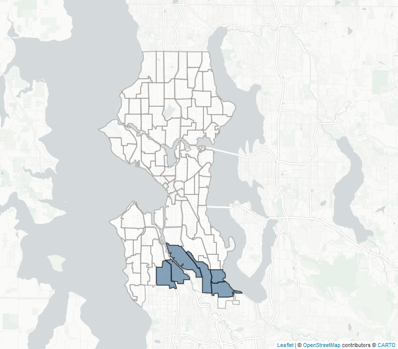{width="1.503961067366579in"
height="2.750041557305337in"}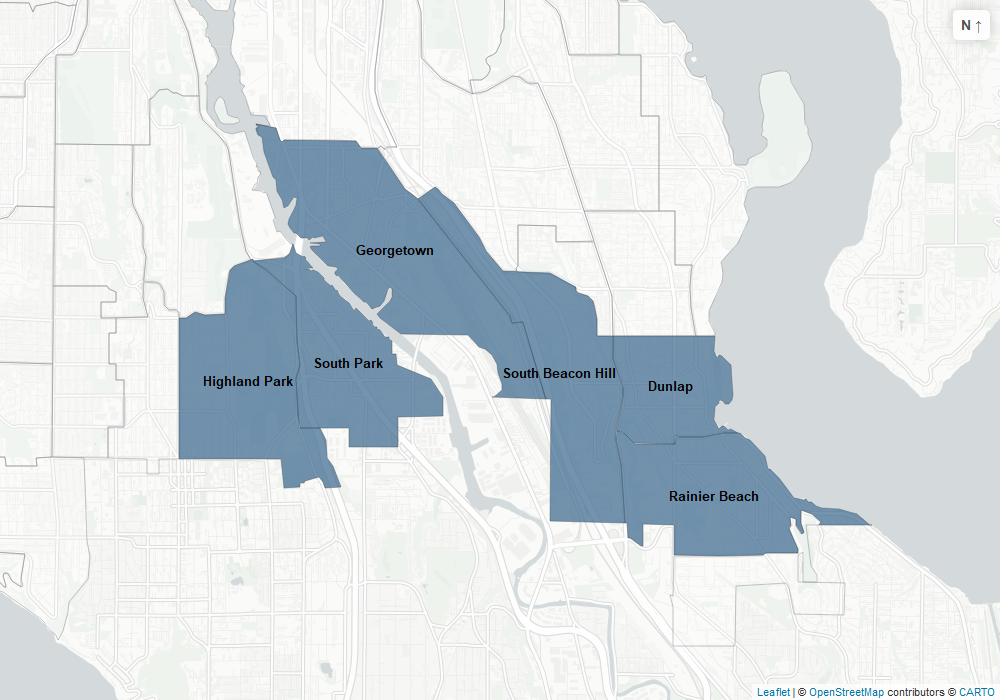{width="4.060640857392826in"
height="2.7291754155730534in"}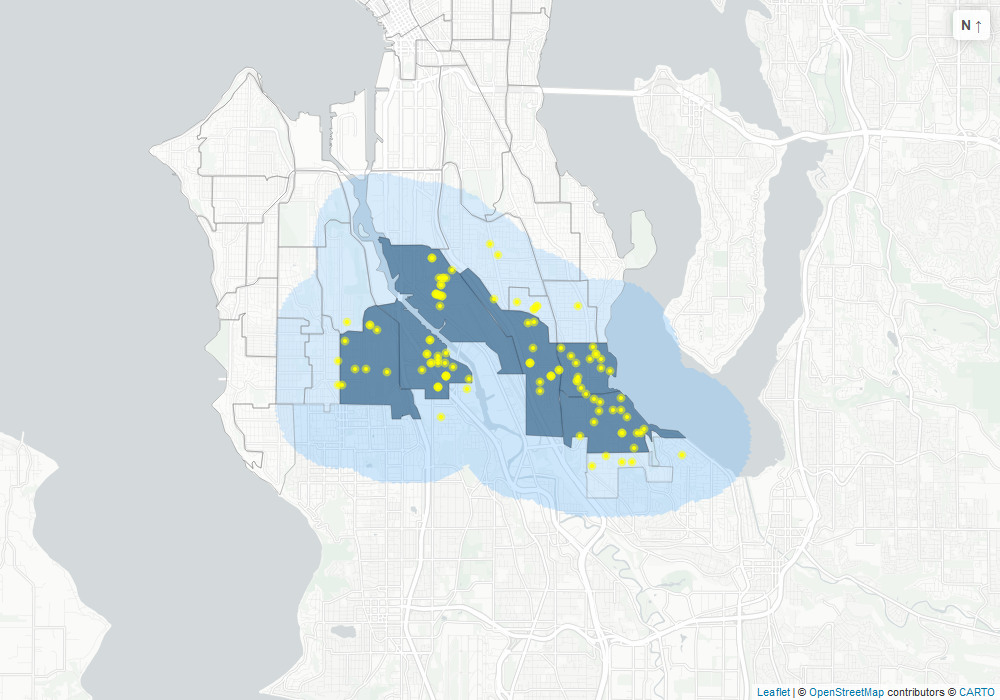{width="5.637299868766404in"
height="3.9479166666666665in"}

Table 2: Demographic Comparison between Census Data of Study Area and
Survey Sample (methodology)

+--------------------+-------------------------------+------------------------+
| **Variable**       | **Seattle Study Area          | SCORE Survey sample    |
|                    | Population (across 6          |                        |
|                    | neighborhoods, n = 33,054)**  | (n=117)                |
+====================+===============+===============+========================+
| **Median Household | \$89,130                      | \$68,334               |
| Income**           |                               |                        |
+--------------------+-------------------------------+------------------------+
| **Home Ownership** | 64%                           | 62%                    |
+--------------------+-------------------------------+------------------------+
| **Race and         | 13% Hispanic or Latino        | 12% Hispanic or Latino |
| Ethnicity**        |                               |                        |
+--------------------+-------------------------------+------------------------+
| **Disability**     | 12% (disability defined as an | 25% (disability        |
|                    | individual with a hearing,    | defined as ('condition |
|                    | visual, cognitive,            | worsened by a power    |
|                    | ambulatory, self-care, or     | outage')               |
|                    | independent living            |                        |
|                    | disability)                   |                        |
+--------------------+-------------------------------+------------------------+
| **Transportation** | 9% do not own a vehicle       | 7% of households do    |
|                    |                               | not own or have access |
|                    |                               | to a vehicle           |
+--------------------+---------------+---------------+------------------------+
| **Age**            | Median Age    | 39            | 42                     |
|                    +---------------+---------------+------------------------+
|                    | Households    | 30%           | 58%                    |
|                    | with          |               |                        |
|                    | individuals   |               |                        |
|                    | under 18      |               |                        |
|                    +---------------+---------------+------------------------+
|                    | Households    | 28%           | 23%                    |
|                    | with          |               |                        |
|                    | individuals   |               |                        |
|                    | over 65       |               |                        |
+--------------------+---------------+---------------+------------------------+
| **Household Size** | 1 Person      | 28%           | 15%                    |
|                    +---------------+---------------+------------------------+
|                    | 2 Person      | 31%           | 30%                    |
|                    +---------------+---------------+------------------------+
|                    | 3 Person      | 17%           | 21%                    |
|                    +---------------+---------------+------------------------+
|                    | 4 Person or   | 24%           | 35%                    |
|                    | more          |               |                        |
+--------------------+---------------+---------------+------------------------+

**Table 3**: Top 3 POIs by Category in Blue-sky Circumstances\*

+--------------+-------------+------------------------+-----------+-------------+
| **Category** | **POI       | **Name/Location**      | **Total   | **Average   |
|              | Category**  |                        | Responses | Distance    |
|              |             |                        | within    | Between     |
|              |             |                        | POI       | Respondents |
|              |             |                        | category  | and POIs    |
|              |             |                        | \*\* (N   | (miles)**   |
|              |             |                        | =117)**   |             |
+==============+=============+========================+===========+=============+
| High         | Gas Station | Costco (4401 4th Ave   | 36        | 2.69        |
| Frequency    |             | S)\*\*\*               |           |             |
| Locations    |             |                        |           |             |
|              |             +------------------------+-----------+-------------+
|              |             | Safeway (9262 Rainier  | 27        | 0.83        |
|              |             | Ave S)\*\*\*           |           |             |
|              |             +------------------------+-----------+-------------+
|              |             | Shree\'s Truck Stop    | 15        | 0.84        |
|              |             | Seattle (7801 Detroit  |           |             |
|              |             | Ave SW)                |           |             |
|              +-------------+------------------------+-----------+-------------+
|              | Grocery     | Safeway (9262 Rainier  | 36        | 1.14        |
|              | Store       | Ave S)\*\*\*           |           |             |
|              |             +------------------------+-----------+-------------+
|              |             | Costco (4401 4th Ave   | 33        | 2.52        |
|              |             | S)\*\*\*               |           |             |
|              |             +------------------------+-----------+-------------+
|              |             | Safeway (3900 S        | 21        | 1.48        |
|              |             | Othello St)            |           |             |
|              +-------------+------------------------+-----------+-------------+
|              | Convenience | Seward Park Market     | 11        | 0.83        |
|              | Store       | (9436 Rainier Ave S)   |           |             |
|              |             +------------------------+-----------+-------------+
|              |             | 7-Eleven (5700 Martin  | 10        | 2.24        |
|              |             | Luther King Jr Way S)  |           |             |
|              |             +------------------------+-----------+-------------+
|              |             | Beacon Hill Foods      | 9         | 2.53        |
|              |             | (4347 15^th^ Ave S)    |           |             |
|              +-------------+------------------------+-----------+-------------+
|              | School      | Cleveland High School  | 11        | 1.39        |
|              |             | (5511 15^th^ Ave       |           |             |
|              |             +------------------------+-----------+-------------+
|              |             | Dunlap Elementary      | 5         | 0.45        |
|              |             | School (4525 S         |           |             |
|              |             | Cloverdale St.)        |           |             |
|              |             +------------------------+-----------+-------------+
|              |             | Mercer International   | 5         | 1.32        |
|              |             | Middle School (7201    |           |             |
|              |             | Beacon Ave S)          |           |             |
|              +-------------+------------------------+-----------+-------------+
|              | Worship     | Apostolic Christian    | 7         | 2.10        |
|              | Place       | Life Tabernacle (8404  |           |             |
|              |             | Renton Ave S)          |           |             |
|              |             +------------------------+-----------+-------------+
|              |             | Rainier Beach          | 3         | 0.41        |
|              |             | Presbyterian Church    |           |             |
|              |             | (9656 Waters Ave S.)   |           |             |
|              |             +------------------------+-----------+-------------+
|              |             | Seattle Bible Church   | 3         | 0.99        |
|              |             | Ministry (9439 17^th^  |           |             |
|              |             | Ave SW)                |           |             |
+--------------+-------------+------------------------+-----------+-------------+
| High Impact  | Dialysis    | Northwest Kidney       | 7         | 1.58        |
| Locations    | Center      | Centers (4401 S        |           |             |
|              |             | Trenton St)            |           |             |
|              |             +------------------------+-----------+-------------+
|              |             | VA Hospital Renal      | 7         | 2.62        |
|              |             | Dialysis Unit (1660 S  |           |             |
|              |             | Columbian Way)         |           |             |
|              |             +------------------------+-----------+-------------+
|              |             | Davita Westwood        | 6         | 3.04        |
|              |             | Dialysis Center (2615  |           |             |
|              |             | SW Trenton St)         |           |             |
|              +-------------+------------------------+-----------+-------------+
|              | Doctor      | Sea Mar Community      | 13        | 0.44        |
|              |             | Health Centers (1040 S |           |             |
|              |             | Henderson St)          |           |             |
|              |             +------------------------+-----------+-------------+
|              |             | Kaiser Permenante      | 10        | 2.59        |
|              |             | (5316 Rainier Ave S)   |           |             |
|              |             +------------------------+-----------+-------------+
|              |             | NeighborCare (9245     | 7         | 0.74        |
|              |             | Rainier Ave S)         |           |             |
|              +-------------+------------------------+-----------+-------------+
|              | Food Bank   | Rainier Valley Food    | 13        | 0.89        |
|              |             | Bank (9021 Rainier Ave |           |             |
|              |             | S)                     |           |             |
|              |             +------------------------+-----------+-------------+
|              |             | St. Vincent De Paul    | 12        | 1.53        |
|              |             | Georgetown Food Bank   |           |             |
|              |             | (5972 4th Ave S)       |           |             |
|              |             +------------------------+-----------+-------------+
|              |             | Lifelong Chicken Soup  | 9         | 1.79        |
|              |             | Brigade Food Bank (210 |           |             |
|              |             | South Lucile St)       |           |             |
|              +-------------+------------------------+-----------+-------------+
|              | Pharmacy    | Safeway (9262 Rainer   | 18        | 0.78        |
|              |             | Ave S)                 |           |             |
|              |             +------------------------+-----------+-------------+
|              |             | Costco Pharmacy (4401  | 15        | 2.15        |
|              |             | 4^th^ Ave S)           |           |             |
|              |             +------------------------+-----------+-------------+
|              |             | Kaiser Permenante      | 9         | 2.28        |
|              |             | (5316 Rainer Ave S)    |           |             |
+--------------+-------------+------------------------+-----------+-------------+
| Other        | Community   | South Park Community   | 20        | 0.61        |
|              | Center      | Center (8825 8^th^ Ave |           |             |
|              |             | S)                     |           |             |
|              |             +------------------------+-----------+-------------+
|              |             | Rainier Beach          | 14        | 0.72        |
|              |             | Community Center (8825 |           |             |
|              |             | Rainier Ave S)         |           |             |
|              |             +------------------------+-----------+-------------+
|              |             | Rainier Beach          | 10        | 0.68        |
|              |             | Community Club (6038 S |           |             |
|              |             | Pilgrim St)            |           |             |
|              +-------------+------------------------+-----------+-------------+
|              | Library     | Rainier Beach Branch   | 17        | 1.08        |
|              |             | (9125 Rainier Ave S)   |           |             |
|              |             +------------------------+-----------+-------------+
|              |             | South Park Branch      | 17        | 0.48        |
|              |             | (8604 8^th^ Ave S)     |           |             |
|              |             +------------------------+-----------+-------------+
|              |             | High Point Branch      | 3         | 1.68        |
|              |             | (3411 SW Raymond St)   |           |             |
+--------------+-------------+------------------------+-----------+-------------+

\* The categories of POIs in this table include only those where 20% or
more of respondents reported utilizing the category on a weekly and
daily basis. See question 33 in Appendix B for specific wording of the
question.

\*\* Respondents were able to provide more than one answer in each POI
category.

\*\*\* This is a POI with multiple functions clustered in one place

Figure 2: Vulnerability to Power Outages --based upon service dependency
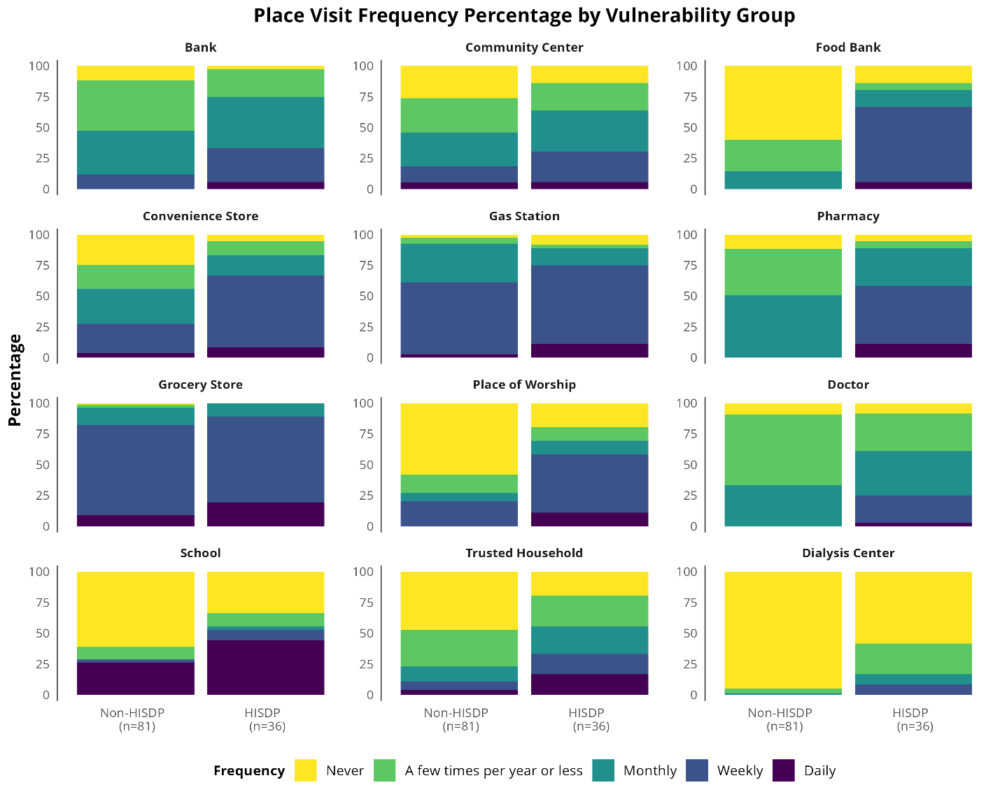{width="6.5in" height="5.197915573053368in"}

HISDP (high impact service dependent population) \--\> (at least 1
category dependent)

Table 4: Different Location Types with different Travel Time

  ------------------------------------------------------------------------
  poi type                         total closest count        \% Selecting
                                   count               Closest Facility by
                                                               Travel Time
  --------------------------- ---------- ------------- -------------------
  [library]{.mark}                    44            30              68.18%

  [community center]{.mark}           99            34              34.34%

  [typical dialysis center            20             6              30.00%
  selected]{.mark}                                     

  food bank                           74            22              29.73%

  doctor                              86            24              27.91%

  school                              74            12              16.22%

  gas station                        174            28              16.09%

  worship place                       51             8              15.69%

  [pharmacy]{.mark}                  141            20              14.18%

  convenience store                  121            17              14.05%

  [grocery store]{.mark}             214            26              12.15%
  ------------------------------------------------------------------------

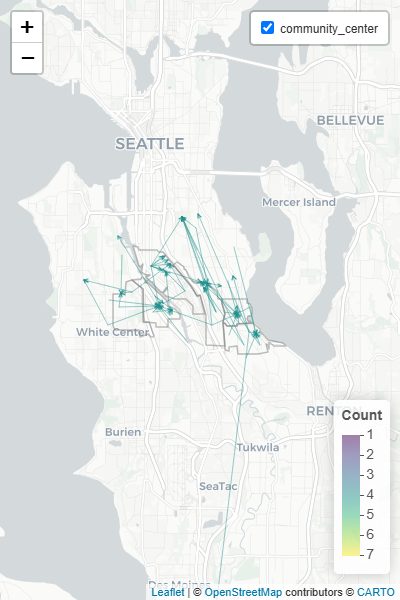{width="2.0in"
height="3.0in"}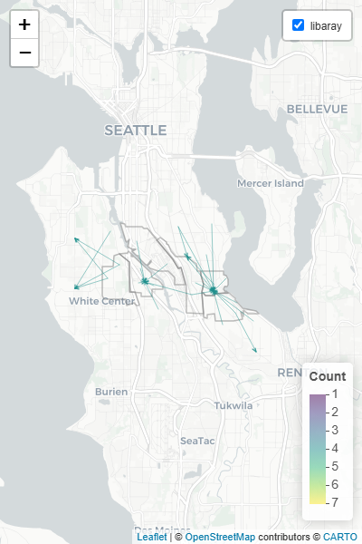{width="2.0in"
height="3.0in"}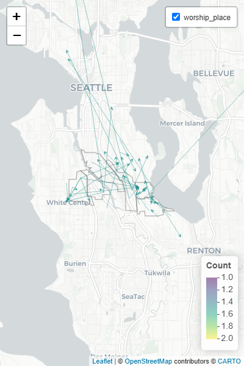{width="2.0in"
height="3.0in"}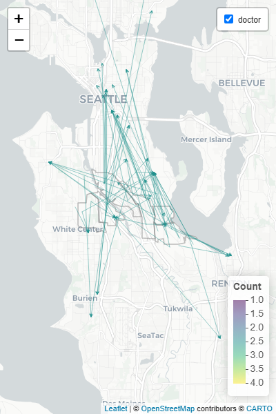{width="2.0in"
height="3.0in"}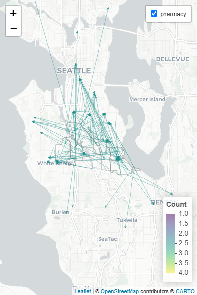{width="2.0in"
height="3.0in"}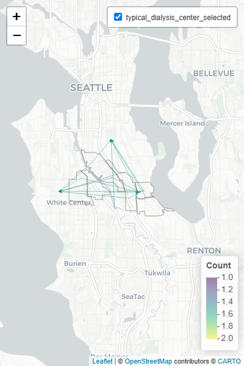{width="2.0in"
height="3.0in"}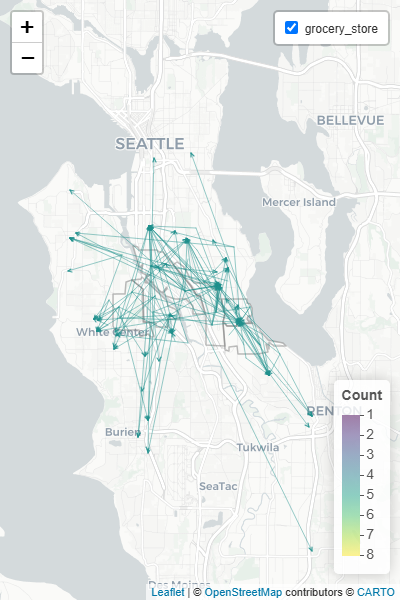{width="2.0in"
height="3.0in"}{width="2.0in"
height="3.0in"}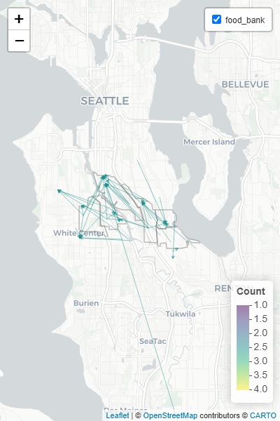{width="2.0in"
height="3.0in"}

Figure 3: Proximity Map (to illustrate that not all locations are
dependent on proximity)

Figure 4: **Categorized responses to the question "In less than two
sentences, please describe what you would be most worried or concerned
about during a long-term power outage in your home and why."**

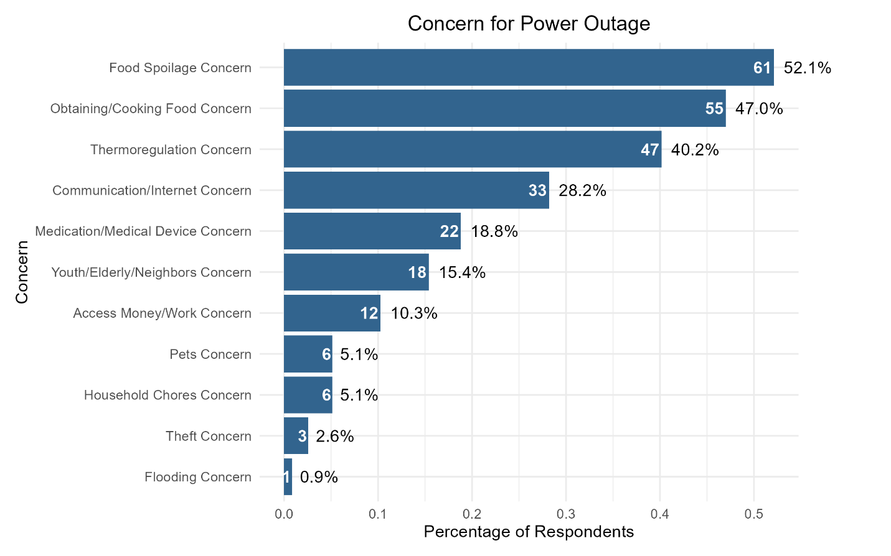{width="6.5in" height="4.0625in"}

Table 5: **Frequency of selections by respondents of locations preferred
to meet needs during hypothetical power outage. Darker green indicates
higher frequency of responses.**

+--------------+------------------+--------+--------------+---------+------------+--------------+-----------+--------------+-------------+-------------------+-----------------+--------------+---------+-----------+
| **Category** | **Location       | **Cook | **Obtain     | **Store | **Store    | **Healthcare | **Operate | **Thermal    | **Hygiene** | **Communication** | **Information** | **Lighting** | **Other | **Total** |
|              | Types**          | Food** | Food/Water** | Food**  | Medicine** | Procedure**  | Medical   | Regulation** |             |                   |                 |              | Tasks** |           |
|              |                  |        |              |         |            |              | Device**  |              |             |                   |                 |              |         |           |
+==============+==================+=======:+=============:+========:+===========:+=============:+==========:+=============:+============:+==================:+================:+=============:+========:+==========:+
| High         | Grocery store    | 3      | 10           | 8       | 4          | 3            | 5         | 7            | 0           | 0                 | 0               | 5            | 0       | 45        |
| Frequency    |                  |        |              |         |            |              |           |              |             |                   |                 |              |         |           |
| Location     |                  |        |              |         |            |              |           |              |             |                   |                 |              |         |           |
|              +------------------+--------+--------------+---------+------------+--------------+-----------+--------------+-------------+-------------------+-----------------+--------------+---------+-----------+
|              | Gas station      | 3      | 0            | 0       | 0          | 0            | 0         | 0            | 0           | 0                 | 4               | 0            | 0       | 7         |
|              +------------------+--------+--------------+---------+------------+--------------+-----------+--------------+-------------+-------------------+-----------------+--------------+---------+-----------+
|              | Convenience      | 3      | 5            | 5       | 0          | 0            | 0         | 0            | 3           | 0                 | 4               | 6            | 0       | 26        |
|              | store            |        |              |         |            |              |           |              |             |                   |                 |              |         |           |
|              +------------------+--------+--------------+---------+------------+--------------+-----------+--------------+-------------+-------------------+-----------------+--------------+---------+-----------+
|              | School           | 0      | 0            | 0       | 4          | 0            | 0         | 0            | 6           | 0                 | 4               | 0            | 0       | 14        |
|              +------------------+--------+--------------+---------+------------+--------------+-----------+--------------+-------------+-------------------+-----------------+--------------+---------+-----------+
|              | Place of Worship | 3      | 0            | 0       | 0          | 6            | 0         | 3            | 3           | 6                 | 0               | 0            | 0       | 21        |
+--------------+------------------+--------+--------------+---------+------------+--------------+-----------+--------------+-------------+-------------------+-----------------+--------------+---------+-----------+
| High Impact  | Doctor\'s office | 0      | 0            | 0       | 0          | 9            | 0         | 0            | 0           | 0                 | 0               | 0            | 0       | 9         |
| Location     |                  |        |              |         |            |              |           |              |             |                   |                 |              |         |           |
|              +------------------+--------+--------------+---------+------------+--------------+-----------+--------------+-------------+-------------------+-----------------+--------------+---------+-----------+
|              | Dialysis center  | 0      | 0            | 0       | 0          | 3            | 0         | 0            | 0           | 0                 | 0               | 0            | 0       | 3         |
|              +------------------+--------+--------------+---------+------------+--------------+-----------+--------------+-------------+-------------------+-----------------+--------------+---------+-----------+
|              | Food bank        | 0      | 9            | 7       | 0          | 0            | 0         | 0            | 0           | 0                 | 4               | 0            | 3       | 22        |
|              +------------------+--------+--------------+---------+------------+--------------+-----------+--------------+-------------+-------------------+-----------------+--------------+---------+-----------+
|              | Pharmacy         | 0      | 2            | 2       | 8          | 10           | 10        | 0            | 3           | 0                 | 0               | 0            | 0       | 36        |
|              +------------------+--------+--------------+---------+------------+--------------+-----------+--------------+-------------+-------------------+-----------------+--------------+---------+-----------+
|              | Hospital         | 0      | 2            | 0       | 0          | 8            | 5         | 6            | 0           | 0                 | 0               | 0            | 0       | 21        |
+--------------+------------------+--------+--------------+---------+------------+--------------+-----------+--------------+-------------+-------------------+-----------------+--------------+---------+-----------+
| Other        | Hardware         | 3      | 0            | 0       | 0          | 0            | 0         | 0            | 0           | 0                 | 0               | 2            | 0       | 5         |
|              | store/Outdoor    |        |              |         |            |              |           |              |             |                   |                 |              |         |           |
|              | supply store     |        |              |         |            |              |           |              |             |                   |                 |              |         |           |
|              +------------------+--------+--------------+---------+------------+--------------+-----------+--------------+-------------+-------------------+-----------------+--------------+---------+-----------+
|              | Laundromat       | 3      | 0            | 0       | 0          | 0            | 0         | 0            | 8           | 0                 | 0               | 0            | 0       | 11        |
|              +------------------+--------+--------------+---------+------------+--------------+-----------+--------------+-------------+-------------------+-----------------+--------------+---------+-----------+
|              | Restaurant       | 8      | 7            | 2       | 0          | 0            | 0         | 3            | 0           | 3                 | 0               | 0            | 0       | 23        |
|              +------------------+--------+--------------+---------+------------+--------------+-----------+--------------+-------------+-------------------+-----------------+--------------+---------+-----------+
|              | Bank             | 0      | 0            | 0       | 0          | 0            | 0         | 3            | 0           | 0                 | 4               | 0            | 0       | 7         |
|              +------------------+--------+--------------+---------+------------+--------------+-----------+--------------+-------------+-------------------+-----------------+--------------+---------+-----------+
|              | Community        | 7      | 2            | 0       | 0          | 0            | 0         | 9            | 3           | 10                | 10              | 10           | 10      | 61        |
|              | center/Gathering |        |              |         |            |              |           |              |             |                   |                 |              |         |           |
|              | space            |        |              |         |            |              |           |              |             |                   |                 |              |         |           |
+--------------+------------------+--------+--------------+---------+------------+--------------+-----------+--------------+-------------+-------------------+-----------------+--------------+---------+-----------+
| Residential  | Home of a family | 10     | 8            | 9       | 0          | 0            | 5         | 10           | 10          | 9                 | 8               | 8            | 7       | 83        |
| Location     | member           |        |              |         |            |              |           |              |             |                   |                 |              |         |           |
|              +------------------+--------+--------------+---------+------------+--------------+-----------+--------------+-------------+-------------------+-----------------+--------------+---------+-----------+
|              | Home of a friend | 9      | 5            | 10      | 10         | 0            | 0         | 8            | 9           | 8                 | 9               | 9            | 7       | 83        |
|              +------------------+--------+--------------+---------+------------+--------------+-----------+--------------+-------------+-------------------+-----------------+--------------+---------+-----------+
|              | Trusted          | 7      | 0            | 5       | 4          | 3            | 0         | 3            | 0           | 6                 | 7               | 4            | 3       | 42        |
|              | household on my  |        |              |         |            |              |           |              |             |                   |                 |              |         |           |
|              | block            |        |              |         |            |              |           |              |             |                   |                 |              |         |           |
+--------------+------------------+--------+--------------+---------+------------+--------------+-----------+--------------+-------------+-------------------+-----------------+--------------+---------+-----------+

Figure 5: **Responses to the question "Please select all locations where
you might consider relocating for the duration of the outage." Responses
that listed "other please explain": six respondents mentioned
hotel/Airbnb as a potential relocation choice, two stated they would
relocate anywhere that accepted pets, one stated their office/workplace,
and one stated they were open to relocating but they did not provide
their first choice.**

{width="6.5in" height="4.0625in"}
